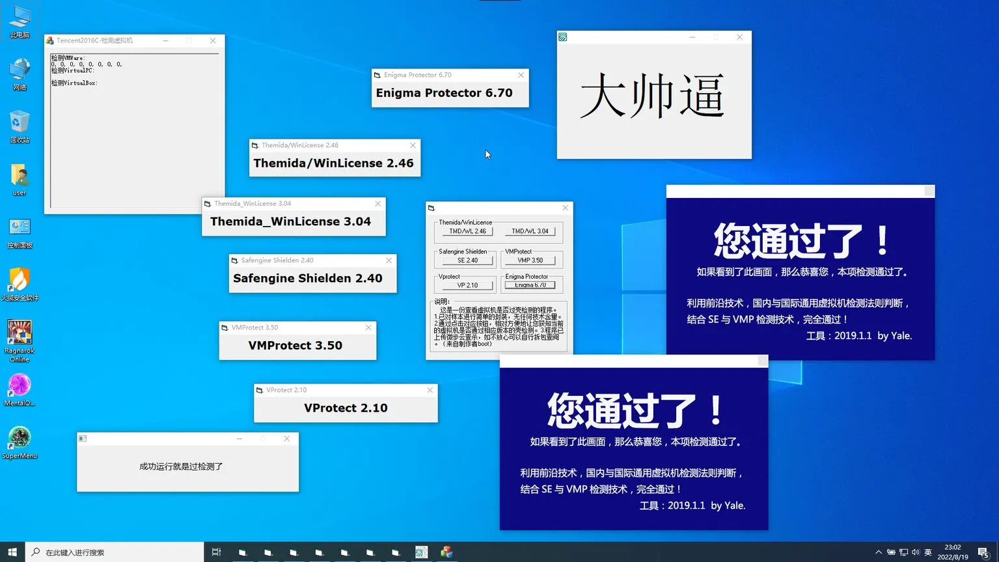

# QEMU Anti Detection
These QEMU patch modifies virtual hardware identifiers and system data reported by the emulator, to help prevent virtual machine detection. The modification involve, Device Renaming, Serial Number Alteration, UEFI VM Bit Removal, Boot Graphics Record Table (BGRT) and more!
This is not a silver bullet because of timing based attacks like RDTSC (Read Time-Stamp Counter) which is reported incorrectly in a VM, see [RDTSC-KVM-Handler](https://github.com/WCharacter/RDTSC-KVM-Handler) or [updated but only for intel](https://github.com/YungBinary/RDTSC-KVM-Handler-v2) and some other factors which are listed below under Flaws.

Fork of the original [qemu-anti-detection](https://github.com/zhaodice/qemu-anti-detection)

 | Type       | Engine | Bypass |
 |------------|--------|--------|
 | AntiCheat  | Anti Cheat Expert (ACE) | ☑️ |
 | AntiCheat  | Easy Anti Cheat (EAC) | ☑️ | 
 | AntiCheat  | Gepard Shield | ☑️ (Needs patched kernel on host: https://github.com/WCharacter/RDTSC-KVM-Handler ) |
 | AntiCheat  | Mhyprot | ☑️ |
 | AntiCheat  | nProtect GameGuard (NP) | ☑️ | 
 | AntiCheat  | Roblox | ☑️ May work with Hyper-V in the guest: https://github.com/zhaodice/qemu-anti-detection/issues/56 | 
 | AntiCheat  | Vanguard | ‼️(1: Incorrect function) | 
 | Encrypt    | Enigma Protector | ☑️ | 
 | Encrypt    | Safegine Shielden | ☑️ |
 | Encrypt    | Themida | ☑️ |
 | Encrypt    | VMProtect | ☑️ | 
 | Encrypt    | VProtect | ☑️ |       

‼️ There are still a lot games that cannot run under this environment because the games are becoming more and more complex, it is hard to know what they are looking at to detect the VM specifically
If you have any clues, feel free to join in!

### Flaws this patch does not fix in QEMU's source:
These commands exit with "No instance(s) available" and could therefore expose the vm. We do not yet know how to simulate this data.
```
wmic path Win32_Fan get *

wmic path Win32_CacheMemory get *

wmic path Win32_VoltageProbe get *

wmic path Win32_PerfFormattedData_Counters_ThermalZoneInformation get *

wmic path CIM_Memory get *

wmic path CIM_Sensor get *

wmic path CIM_NumericSensor get *

wmic path CIM_TemperatureSensor get *

wmic path CIM_VoltageSensor get *
```

## Build Dependencies
⚠️ _Always maintain an installation of QEMU managed by your package manager, because it may delete necessary runtime dependencies otherwise! The binaries you compile are saved in **/usr/local/bin**, so they will take precedence._

**Arch**:
`pacman -Sy bison flex pkgconfig gcc make git wget base-devel glib2 ninja python`

**Without qemu already installed:**
`pacman -Sy bison flex pkgconfig gcc make git wget base-devel glib2 ninja python multipath-tools libxdp vde2 libslirp rutabaga-ffi libiscsi glusterfs dtc ndctl brltty libaio sdl2_image`

## Patching and building QEMU
```
git clone https://codeberg.org/shakakibara/qemu-anti-detection --depth 1
wget https://download.qemu.org/qemu-10.0.2.tar.xz
tar xvJf qemu-10.0.2.tar.xz
cd qemu-10.0.2
patch -p1 < ../qemu-anti-detection/qemu-10.0.2.patch
./configure
sudo make install -j$(nproc)
```

## How to make patches
This is the method which i use to create patch which i learned by myself. So there might be a better
way instead of this, for now this works.
### Download the qemu release
`wget https://download.qemu.org/qemu-10.x.x.tar.xz`
### Extract it
`tar xvJf qemu-10.x.x.tar.xz`
### Initialize a git repo (for creating patch using git)
`git init`
### Commit the changes once
`git commit -am "original files"`
### Apply the existing latest patch available
`patch -p1 < ../qemu-anti-detection/qemu-10.x.x.patch`
### Manually fix the conflicts, adding other modifications etc. Then create patch
`git diff > qemu-10.x.x.patch`
### Profit?


# QEMU XML Config

Insert YOUR virtual machine's uuid.
```
<domain xmlns:qemu="http://libvirt.org/schemas/domain/qemu/1.0" type="kvm">
  <name>Entertainment</name>
  <uuid>REPLACE YOUR UUID HERE!</uuid>
  <metadata>
    <libosinfo:libosinfo xmlns:libosinfo="http://libosinfo.org/xmlns/libvirt/domain/1.0">
      <libosinfo:os id="http://microsoft.com/win/10"/>
    </libosinfo:libosinfo>
  </metadata>
  <memory unit="KiB">1548288</memory>
  <currentMemory unit="KiB">1548288</currentMemory>
  <memoryBacking>
    <source type="memfd"/>
    <access mode="shared"/>
  </memoryBacking>
  <vcpu placement="static">12</vcpu>
  <os firmware="efi">
    <type arch="x86_64" machine="pc-q35-7.0">hvm</type>
    <smbios mode="host"/>
  </os>
  <features>
    <acpi/>
    <apic/>
    <hyperv mode="custom">
      <relaxed state="on"/>
      <vapic state="on"/>
      <spinlocks state="on" retries="8191"/>
      <vendor_id state="on" value="GenuineIntel"/>
    </hyperv>
    <kvm>
      <hidden state="on"/>
    </kvm>
    <vmport state="off"/>
    <smm state="on"/>
    <ioapic driver="kvm"/>
  </features>
  <cpu mode="host-passthrough" check="none" migratable="on">
    <feature policy="disable" name="hypervisor"/>
  </cpu>
  <clock offset="localtime">
    <timer name="rtc" tickpolicy="catchup"/>
    <timer name="pit" tickpolicy="delay"/>
    <timer name="hpet" present="no"/>
    <timer name="hypervclock" present="yes"/>
  </clock>
  <on_poweroff>destroy</on_poweroff>
  <on_reboot>restart</on_reboot>
  <on_crash>destroy</on_crash>
  <pm>
    <suspend-to-mem enabled="no"/>
    <suspend-to-disk enabled="no"/>
  </pm>
  <qemu:commandline>
    <qemu:arg value="-smbios"/>
    <qemu:arg value="type=0,version=UX305UA.201"/>
    <qemu:arg value="-smbios"/>
    <qemu:arg value="type=1,manufacturer=ASUS,product=UX305UA,version=2021.1"/>
    <qemu:arg value="-smbios"/>
    <qemu:arg value="type=2,manufacturer=Intel,version=2021.5,product=Intel i9-12900K"/>
    <qemu:arg value="-smbios"/>
    <qemu:arg value="type=3,manufacturer=XBZJ"/>
    <qemu:arg value="-smbios"/>
    <qemu:arg value="type=17,manufacturer=KINGSTON,loc_pfx=DDR5,speed=4800,serial=000000,part=0000"/>
    <qemu:arg value="-smbios"/>
    <qemu:arg value="type=4,manufacturer=Intel,max-speed=4800,current-speed=4800"/>
    <qemu:arg value="-cpu"/>
    <qemu:arg value="host,family=6,model=158,stepping=2,model_id=Intel(R) Core(TM) i9-12900K CPU @ 2.60GHz,vmware-cpuid-freq=false,enforce=false,host-phys-bits=true,hypervisor=off"/>
    <qemu:arg value="-machine"/>
    <qemu:arg value="q35,kernel_irqchip=on"/>
  </qemu:commandline>
</domain>
```


# Credits and References
[zhaodice](https://github.com/zhaodice/qemu-anti-detection) for giving me the motivation and overall base.
[lixiaoliu666](https://github.com/lixiaoliu666/pve-anti-detection) for showing me the overkill way.

